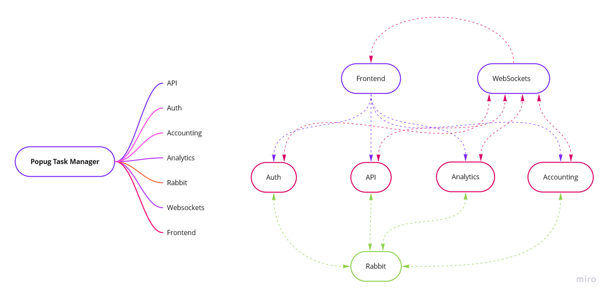

# Popug Task Manager

### MindMap:
[Miro](https://miro.com/app/board/uXjVPVXM5Yk=/?share_link_id=879903306597)

## План

### 1. AUTH
- JWT на основе формы клюва
- Форма клюва
- Имя (Кеша - Админ, Глаша - Бухгалтер, Гоша - Менеджер, Шуша, Бляша, Хрюша)
- Роль (менеджер, администратор, обычный)

### 2. API
- Вход для всех попугов
- Method: Создание задачи:
  - (*) описание
  - (*) статус (выполнена или нет)
  - (*) исполнитель (назначить можно на любого кроме менеджеров и админов)
  - Цены (определяются сервисом Accounting)
- Method: Reassign tasks (для менеджеров и администраторов):
  - Все "открытые" задачи рандомно назначаются на рандомного исполнителя (кроме менеджера и администратора)
  - Назначать задачу можно на кого угодно, кроме менеджера и администратора
- Method: Список своих задач
- Method: Список всех задач (для менеджеров и администраторов)
- Method: Отметить свою задачу выполненной

#### Events:
- API: Создание задачи
- API: Назначение исполнителя (при Reassign)
- API: Отметка задачи выполненной

### 3. Accounting

- Вход для обычных попугов:
  - Method: Текущий баланс
  - Method: Лог операций

- Вход для админов и бухгалтеров:
  - Method: Текущий баланс компании
  - Method: Статистика по дням

- Логи:
  - Лог операций по балансам
    - Дата
    - Пользователь
    - Операция
    - Сумма
  - Лог балансов компании по дням
    - Дата
    - Сумма

#### Events:
- Изменение баланса
- Количество отрицательных попугов

#### Events Handling:
- Accounting: Изменение баланса:
  - Запись в лог
  - Отправить ивент с количеством отрицательных попугов

- API: Создание задачи:
  - Отправить ивент об изменении баланса
    - цена принятия для исполнителя: rand(10..20)$
    - цена награды для исполнителя: rand(20..40)$
    - с исполнителя списывается цена принятия

- API: Назначение исполнителя:
  - Отправить ивент об изменении баланса
    - предыдущему исполнителю возвращается цена принятия
    - с нового исполнителя списывается цена принятия

- API: Отметка задачи выполненной
  - Отправить ивент об изменении баланса
    - исполнителю начисляется цена награды

- Конец дня
  - Посчитать балансы по сотрудникам
    - Если баланс положительный, "выплатить" (обнулить)
    - "Отправить письмо"
    - Отправить ивент с количеством отрицательных попугов
  - Посчитать баланс компании за день:
    - (sum(completed task price) - sum(assigned task fee) * -1
    - (сумма всех закрытых и открытых задач за день с противоположным знаком)

### 4. Analytics

- Вход - для админов
- Хранение аналитики за день / неделю / месяц
- Method: аналитика:
  - Сколько заработала компания за сегодня
  - Сколько попугов ушло в минус сегодня
  - Самая дорогая задача (из закрытых) за текущий день, неделю, месяц

#### Events handling:
- API: Отметка задачи выполненной:
  - Записать как самую дорогую задачу (если это самая дорогая)
  - Посчитать выгоду от этой задачи для компании (???)
- Accounting: количество отрицательных попугов
  - Записать в базу за текущий день
